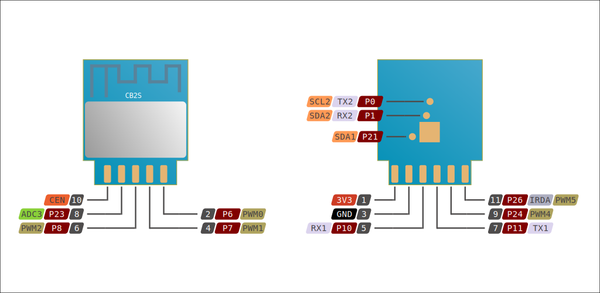

# LoraTap Curtain Relay — ESPHome (CB2S / BK7231N)

[🇪🇸 Lee la versión en castellano](README.es.md)

ESPHome firmware for curtain relay modules based on **CB2S (Beken BK7231N)**, such as those found in **LoraTap SC411WSC**, **LoraTap SC500W-CB2S** or similar devices.

> This project is designed to be **universal and modular**: the same base firmware works for different installations; you only need to pick the physical button configuration file that matches your wall switch.

## Features

- **Stable script-based control** (no `cover` interlock issues).
- **Estimated position** (0–100 %) and memory of the last state.
- **Adjustable up/down travel times** from Home Assistant / web UI.
- **Direction inversion** configurable from HA.
- **60 s safety timeout** to turn off relays if something goes wrong.
- **Built-in web server** for local control without relying on HA.
- **Captive portal** for easy recovery if WiFi fails.
- Support for several wall switch types via included files:
  - 1 button (cycle)
  - 2 buttons (up/down)
  - 3 buttons (up/down/stop)
  - 3-position latching switch
  - No physical buttons

## Confirmed hardware

| Module | CB2S (BK7231N) |
|--------|----------------|
| Example MAC | `38:a5:c9:f0:44:e3` |
| Up relay | **P24** |
| Down relay | **P26** |
| Up button | P23 |
| Down button | P21 |
| Stop button | P7 (candidate) |
| Onboard LED | P10 |

> Button pins may vary depending on the exact model. Pick the right mode and adjust the `substitutions` if needed.

## Important notes about RF remote

The original RF remote works at **868 MHz** and is handled by an **independent receiver module** inside the relay. It does **not** go through the CB2S, so it **cannot be read by ESPHome `remote_receiver`**. If the remote stops working after flashing, the receiver is either damaged or unpaired, not a software issue.

## File structure

```text
.
├── curtain_relay_f044e3_full.yaml    # Recommended stable firmware
├── curtain_relay_f044e3.yaml         # Original base firmware (cover-based)
├── buttons_1way.yaml                 # 1-button cycle
├── buttons_2way.yaml                 # 2 buttons
├── buttons_3way.yaml                 # 3 buttons
├── buttons_latching.yaml             # 3-position latching switch
├── buttons_disabled.yaml             # No physical buttons
├── secrets.yaml.example              # Secrets template
├── PROJECT_MEMORY.md                 # Project lessons and notes
├── README.md                         # This file
└── README.es.md                      # Spanish version
```

## Getting started

1. Copy `secrets.yaml.example` to `secrets.yaml` and fill in your WiFi credentials.
2. **Recommended:** use `curtain_relay_f044e3_full.yaml` as your firmware.
3. Compile and flash via UART:

```bash
esphome compile curtain_relay_f044e3_full.yaml
ltchiptool flash write -d /dev/ttyUSB0 \
  .esphome/build/curtain-relay-f044e3/.pioenvs/curtain-relay-f044e3/firmware.uf2
```

4. The CB2S module enters bootloader mode automatically; no need to bridge CEN to GND on the original PCB.
5. Verify it responds:

```bash
ping curtain-relay-f044e3.local
```

## UART wiring

| CB2S | USB-TTL adapter |
|------|-----------------|
| 3V3  | 3V3 (only if the relay has no own power) |
| GND  | GND |
| TX   | RX |
| RX   | TX |

> **Warning:** never short P26 to GND. It will kill the CB2S and possibly your USB-TTL adapter.

## Soldering and flashing step-by-step

### 1. Identify the CB2S pinout

Check the official LibreTiny CB2S documentation for the full pinout: [https://docs.libretiny.eu/boards/cb2s/#quick-flashing-guide](https://docs.libretiny.eu/boards/cb2s/#quick-flashing-guide)



The CB2S only has pins on the bottom side, but on both edges.

### 2. Prepare the hardware

**If the relay has its own 230 V power supply** (recommended):

- Connect only **GND, RX and TX** from the USB-TTL adapter to the CB2S.
- Do **not** connect 3V3 from the adapter.

**If the relay has no power supply:**

- Connect **3V3, GND, RX and TX** from the adapter.
- Make sure your adapter can supply enough current; otherwise the flash will fail.

### 3. Backup the original firmware (strongly recommended)

Before flashing anything, make a full backup of the stock firmware:

```bash
ltchiptool flash read bk7231n /tmp/relay_backup.bin -d /dev/ttyUSB0
```

Keep the backup safe. If you need to go back to stock, you can restore it.

### 4. Flashing procedure

1. **Power off the relay board** and disconnect it from mains if possible.
2. **Connect the USB-TTL adapter** to your PC.
3. Launch the flash command:

```bash
ltchiptool flash write -d /dev/ttyUSB0 \
  curtain-relay-cb2s/.esphome/build/curtain-relay-f044e3/.pioenvs/curtain-relay-f044e3/firmware.uf2
```

4. **Power on the relay board** (connect to mains or 3.3 V depending on your setup).
5. When the flashing tool shows the UART connection diagram, **bridge CEN to GND** briefly (about 1 second) to enter download mode, then release.

> **Note:** on the original LoraTap PCB, the CB2S usually enters bootloader automatically without bridging CEN. On a bare CB2S module you will need to bridge CEN→GND.

## Customization

Edit the `substitutions` in the YAML to change pins or timeouts:

```yaml
substitutions:
  up_pin: "P24"
  down_pin: "P26"
  btn_up_pin: "P23"
  btn_down_pin: "P21"
  btn_stop_pin: "P7"
  safety_timeout: "60s"
```

## Calibration

Adjust the **Up time (s)** and **Down time (s)** numbers to match your curtain's real travel time. With correct values the position percentage will be accurate.

## References

- [ESPHome LibreTiny / bk72xx](https://esphome.io/components/libretiny.html)
- [LoraTap SC411WSC on devices.esphome.io](https://devices.esphome.io/devices/LoraTap-SC411WSC)
- [LoraTap SC500W on devices.esphome.io](https://devices.esphome.io/devices/LoraTap-SC500W)
- [jojo99's SC500W-CB2S YAML](https://community.home-assistant.io/t/loratap-sc500w-v1-shutter-switch-with-esphome/616375)

## License

AGPL-3.0 — free to use, modify and share under the same terms.
